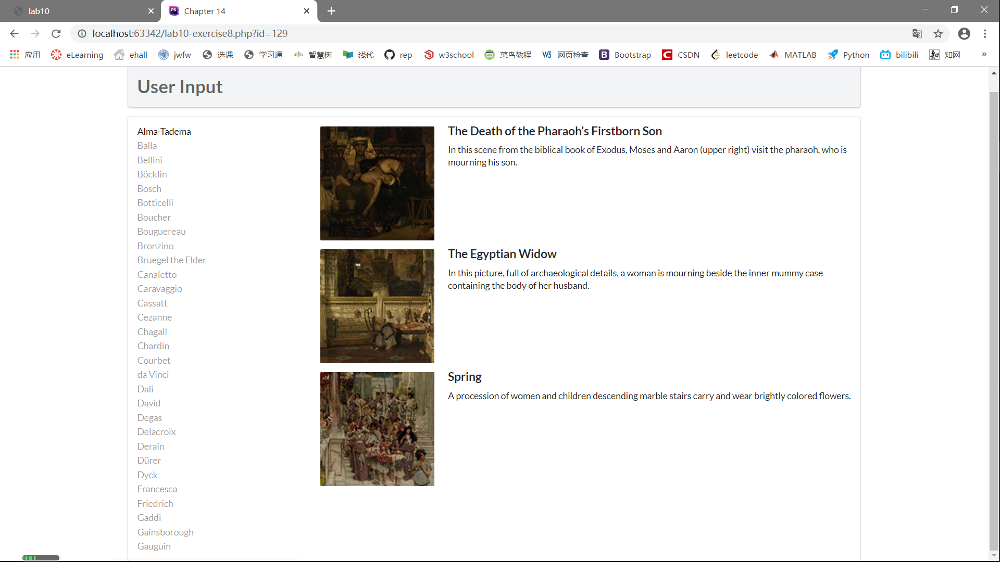
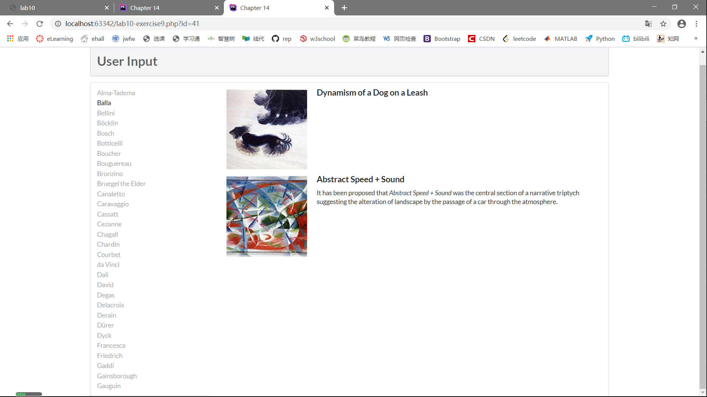
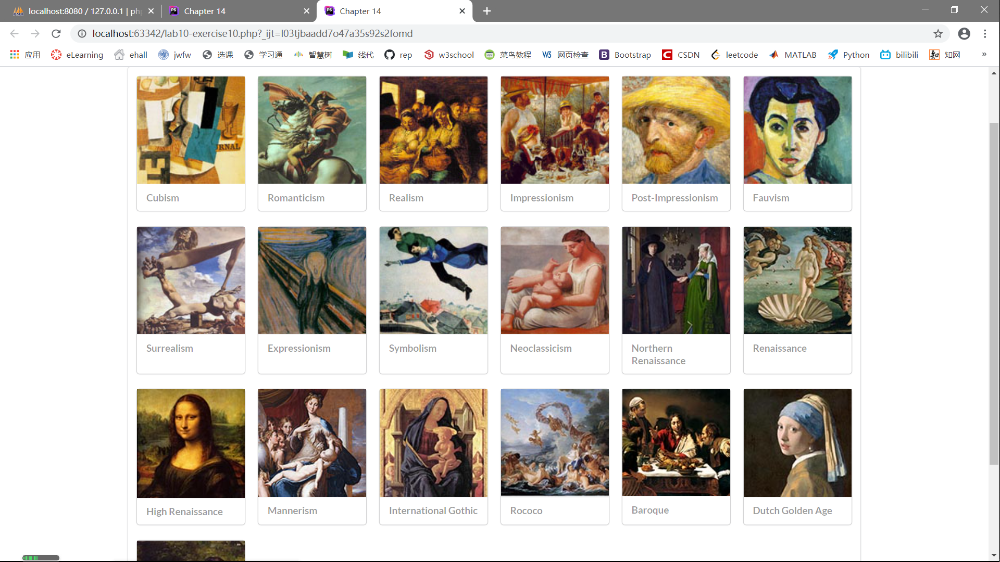

# Lab10设计文档
佘家瑞 19302010035 6月4日

## Exercise 7

### PDO

	<?php  
	try {
		$pdo = new PDO(DBCONNSTRING,DBUSER,DBPASS);  
		$pdo->setAttribute(PDO::ATTR_ERRMODE, PDO::ERRMODE_EXCEPTION);  
		$sql = "select * from Artists order by LastName";
		$result = $pdo->query($sql);
		while ($row = $result->fetch()) {
			echo $row['ArtistID'] . " - " . $row['LastName'] . " "; 
		}
		$pdo = null; 
	}catch (PDOException $e) { 
		die( $e->getMessage() );
	}
	?>  
这段代码做了这些事情：

+ 初始化一个PDO对象，与`art`数据库建立连接，若发生错误则抛出`exception`，并被`catch`语句捕捉；
+ 将`Artists`数据表中的记录按`LastName`进行排序；
+ 对排序后的`Artists`表进行输出，输出内容为`['ArtistID'] - ['LastName'] .`；
+ 终止连接，释放资源。

### 截图如下
.png) 

### mysqli

	<select>
	<?php  
	$connection = mysqli_connect(DBHOST, DBUSER, DBPASS, DBNAME); 
	if ( mysqli_connect_errno() ) {
		die( mysqli_connect_error() ); 
	}
	$sql = "select * from Genres order by GenreName"; 
	if ($result = mysqli_query($connection, $sql)) {
		// loop through the data
		while($row = mysqli_fetch_assoc($result)) {
			echo '<option value="' . $row['GenreID'] . '">'; 
			echo $row['GenreName'];
			echo "</option>";
		}
		// release the memory used by the result set
		mysqli_free_result($result); 
	}
	// close the database connection
	mysqli_close($connection);
	?>
	</select>
这段代码做了这些事情：

+ 创建一个到`art`数据库的连接，如果发生错误就停止创建连接并显示错误信息；
+ 在`Genres`数据表中根据`GenreName`排序；
+ 成功排序后对各条记录进行遍历，作为HTML中`select`元素的`option`元素输出；
+ 释放占用的资源，断开连接。

### 截图如下
.png) 

----------

## Exercise8

### outputArtists()

	function outputArtists() {
	   try {
	         $pdo = new PDO(DBCONNSTRING,DBUSER,DBPASS);
	         $pdo->setAttribute(PDO::ATTR_ERRMODE, PDO::ERRMODE_EXCEPTION);
	         $sql = "select * from Artists order by LastName limit 0,30";
	         $result = $pdo->query($sql);
	         while ($row = $result->fetch()) {
	            echo '<a href="' . $_SERVER["SCRIPT_NAME"] . '?id=' . $row['ArtistID'] . '" class="';
	            if (isset($_GET['id']) && $_GET['id'] == $row['ArtistID']) echo 'active ';
	            echo 'item">';
	            echo $row['LastName'] . '</a>';
	         }
	         $pdo = null;
	   }
	   catch (PDOException $e) {
	      die( $e->getMessage() );
	   }
	}
这段代码做了这些事情：

+ 初始化一个PDO对象，与`art`数据库建立连接，若连接错误则抛出`exception`并由`catch`语句捕获，显示错误信息；
+ 对`Artists`数据表按照`LastName`进行排序，并显示前30条结果；
+ 对结果进行遍历，根据每一条记录的内容以及该记录是否被点击生成一段HTML代码；
+ 断开连接，释放资源。

### outputPaintings()

	function outputPaintings() {
		try {
        	if (isset($_GET['id']) && $_GET['id'] > 0) {
         		$pdo = new PDO(DBCONNSTRING,DBUSER,DBPASS); 
          		$pdo->setAttribute(PDO::ATTR_ERRMODE, PDO::ERRMODE_EXCEPTION);
          		$sql = 'select * from Paintings where ArtistId=' . $_GET['id']; 
          		$result = $pdo->query($sql);
          		while ($row = $result->fetch()) {
             		outputSinglePainting($row); 
          		}
          		$pdo = null; 
        	}
      	}catch (PDOException $e) {
         	die( $e->getMessage() ); 
      	}
	}
这段代码做了这些事情：

+ 得到表单传递的值后，初始化一个PDO对象，与`art`数据库建立连接，如果连接错误则抛出`exception`，被`catch`语句捕获，显示错误信息；
+ 在`Paintings`数据表里找到符合表单传递的值的记录；
+ 对找到的记录进行遍历，调用`outputSinglePainting()`函数；
+ 关闭连接，释放资源。

### outputSinglePaintings()

	function outputSinglePainting($row) {
      	echo '
';
      	echo '
';
      	echo ''; 
      	echo '
';
      	echo '
';
      	echo '<h4 class="header">'; 
      	echo $row['Title'];
      	echo '</h4>';
      	echo '
';
      	echo $row['Excerpt'];
      	echo '
';
      	echo '
'; // end class=content 
      	echo '
'; // end class=item
	}
这段代码根据参数创建了一段HTML代码，作用是输出参数有关记录。

### 截图如下
 

----------

## Exercise9

执行SQL语句的几种方式：

+ DriverManager：用于管理JDBC驱动的服务类，主要功能是获取Connection对象；
+ Connection：代表数据库连接对象，每个Connection代表一个物理连接会话；
+ Statement：用于执行SQL语句的工具接口；
+ PrepareStatement：Statement的子接口，预编译SQL语句。

PrepareStatement有如下优点：

+ 预编译了SQL语句，性能更好，执行更快；
+ 无须拼接SQL语句，编程更简单；
+ 可以防止SQL注入，安全性更好。

### 截图如下
 

----------

## Exercise10

这一部分创建了有图片、链接的页面。

### outputGenres()

	function outputGenres() { 
      	try {
         	$pdo = new PDO(DBCONNSTRING,DBUSER,DBPASS); 
         	$pdo->setAttribute(PDO::ATTR_ERRMODE, PDO::ERRMODE_EXCEPTION);
   
         	$sql = 'select GenreId, GenreName, Description from Genres Order By GenreID';
         	$result = $pdo->query($sql); 
         
         	while ($row = $result->fetch()) {
            	outputSingleGenre($row); 
         	}
         	$pdo = null;
      	}catch (PDOException $e) {
         	die( $e->getMessage() ); 
      	}
	} 
这段代码做了这些事情：

+ 初始化一个PDO对象，与`art`数据库建立连接，如果出现错误就抛出`exception`并被`catch`语句捕获，显示错误信息；
+ 将`Genres`数据表中`GenreId`、`GenreName`、`Description`按照`GenreID`进行排序；
+ 对排序结果进行遍历，利用`outputSingleGenre()`函数进行输出；
+ 关闭连接，释放资源。

### outputSingleGenre()

	function outputSingleGenre($row) {
		echo '
';
		echo '
';
		$img = '';
		echo constructGenreLink($row['GenreId'], $img);
		echo '
';
		echo '
';
		echo '<h4>';
		echo constructGenreLink($row['GenreId'], $row['GenreName']);
		echo '</h4>';
		echo '
'; // end class=extra
		echo '
'; // end class=card
	}
这段代码生成了一段HTML代码，输出与传进来的参数有关的内容。

### constructGenreLink()

	function constructGenreLink($id, $label) {
	      $link = '<a href="genre.php?id=' . $id . '">';
	      $link .= $label;
	      $link .= '</a>';
	      return $link;
	}
这段代码根据传进来的参数生成一个链接。

### 截图如下
 
