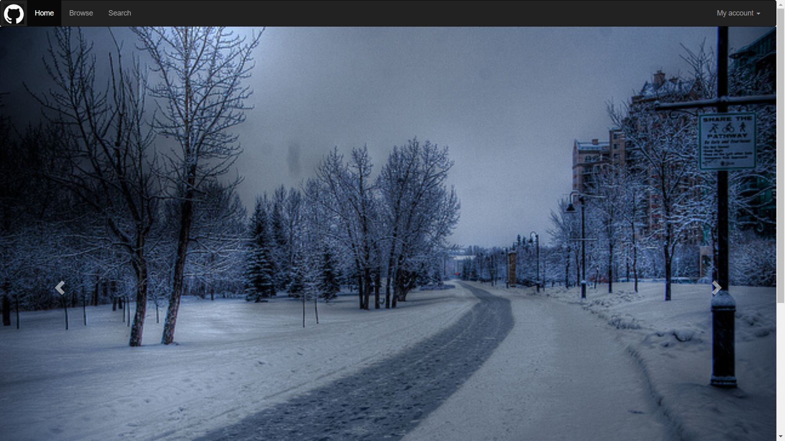

LAB 4 设计文档
==========
本次lab的布局主要继承了助教给出的框架，增添了一些自己的内容。

----------

##导航栏部分

设置了图标，其余部分没有大改动。

----------

##轮播图部分

1.修改了**margin**属性，使得这部分与导航栏之间没有空白，否则影响美观。

2.图片采用了pj1中的图片，修改了每张图片的介绍。设计过程中发现图片没有占满屏幕，给图片添加了**class="img-responsive"**属性。

**遇到的问题：**图片尺寸不符合轮播图的内容框，在展示的过程中会先出现一些空白，过了短暂的时间后才能填充这些空白。

----------

##页脚部分

增加了页脚部分需要的图标及二维码图片，其余部分没有大改动。

----------

##图片

所有图片均存放在images文件夹中，并进行了分类。

----------

##效果图

