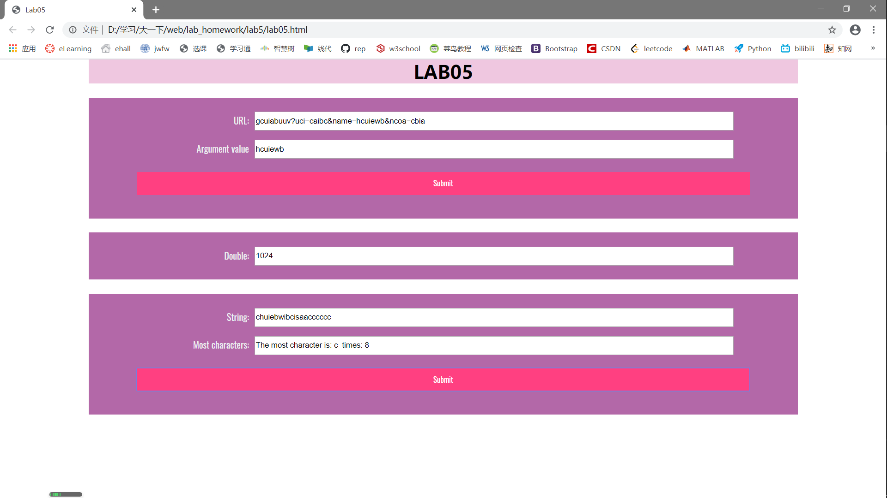

# Lab5设计文档
19302010035 佘家瑞

----------

## 第一个问题的解决
先对输入的url可能情况进行分类，然后再用`if-else`分别解决

1.`name` 参数处在中间部分：正则表达式 `/.*name=.*&.*/i` ，截取name后的字符串，再截取出&前的内容，即为name的内容；

2.`name` 参数处在结尾部分：正则表达式 `/.*name=【^&】*/i` ，截取name后的字符串，直接读到结尾；

3.没有 `name` 参数：利用 `Math.random()` 函数从 `A-Za-z0-9` 生成长度为10的随机字符串。

----------

## 第二个问题的解决
设置一个计数变量，用 `setInterval()` 函数来实现每隔五秒数字翻倍，用 `if` 语句判断是否可以停止翻倍。

----------

## 第三个问题的解决
建立一个对象，将出现过的字符和出现次数分别作为对象的 `property` 和 `value` ，读取完整个字符串之后，用 `Math.max()` 方法找出存放 `value` 的数组中的最大值，再用这个最大值映射得到对应的字符，便完成了要求。

----------

## 截图如下

